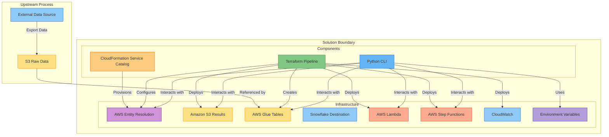
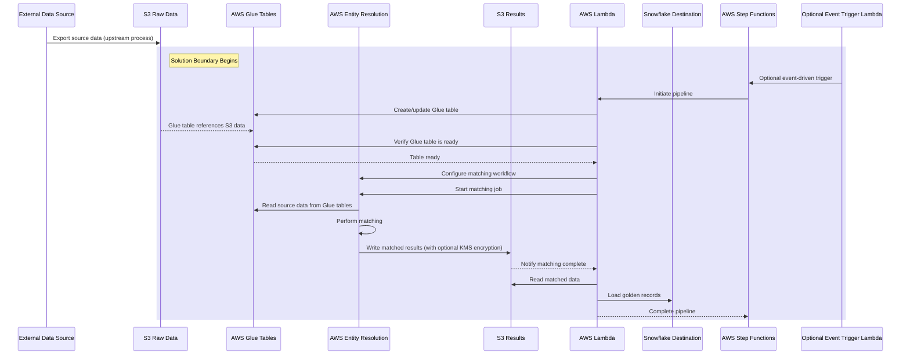
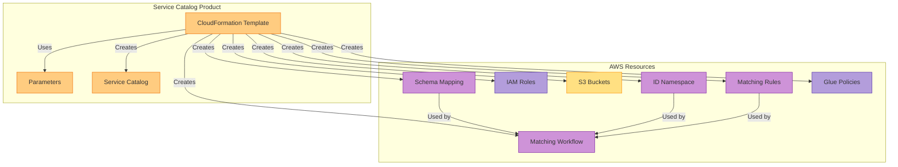
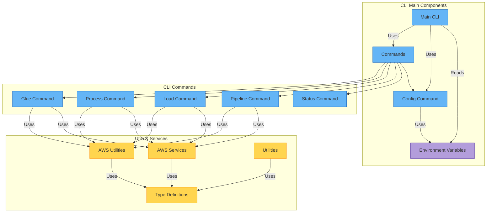
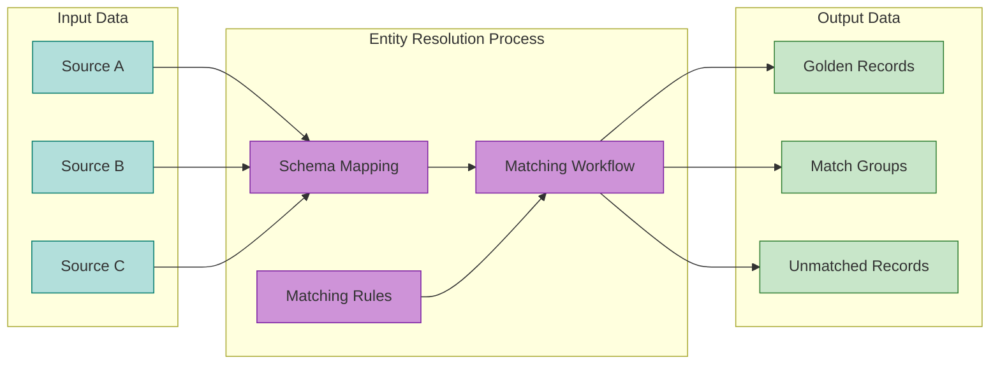
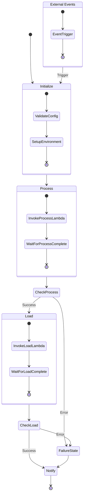

# AWS Entity Resolution Architecture

This document provides a detailed architecture overview of the AWS Entity Resolution solution. The solution enables businesses to identify and link records that represent the same entities across disparate data sources.

## System Overview

The AWS Entity Resolution solution consists of three main components:

1. **Service Catalog Product**: A CloudFormation template that provisions AWS Entity Resolution resources
2. **Terraform Pipeline**: Infrastructure as Code (IaC) for the complete entity resolution data pipeline
3. **Python CLI**: A command-line tool for operating the pipeline

## Solution Boundary and Dependencies

The Entity Resolution pipeline starts with data that has already been exported from Snowflake to S3. This upstream data movement is **not part of this solution**. The solution boundary begins with:

1. Creating AWS Glue tables that reference the S3 data exported from Snowflake
2. Using AWS Entity Resolution to match entities based on Glue tables
3. Loading the matched results to Snowflake

## Data Flow Architecture

The entity resolution data pipeline follows a sequential flow of processing and loading:

## Component Architecture

### 1. CloudFormation Service Catalog Product

The CloudFormation template provisions AWS Entity Resolution resources and creates a Service Catalog product for easy deployment.

### 2. Terraform Pipeline

The Terraform pipeline deploys the infrastructure necessary for the complete data flow:

```mermaid
graph TB
    subgraph "Terraform Modules"
        Main[Main Module]
        GlueMod[Glue Module]
        ProcessorMod[Processor Module]
        LoaderMod[Loader Module]
        OrchestratorMod[Orchestrator Module]
        MonitoringMod[Monitoring Module]
        EventTriggerMod[Event Trigger Module]
    end

    subgraph "AWS Resources"
        LambdaGlue[Glue Table Lambda]
        LambdaProcess[Process Lambda]
        LambdaLoad[Load Lambda]
        LambdaCheck[Check Status Lambda]
        LambdaNotify[Notification Lambda]
        LambdaTrigger[Event Trigger Lambda]

        S3Results[Results S3 Bucket]
        ExistingS3[Pre-created S3 Bucket]
        GlueTables[Glue Tables]
        KMSKey[KMS Key]

        StateMachine[Step Functions State Machine]

        CWDashboard[CloudWatch Dashboard]
        CWAlarms[CloudWatch Alarms]
    end

    Main -- "Uses" --> GlueMod
    Main -- "Uses" --> ProcessorMod
    Main -- "Uses" --> LoaderMod
    Main -- "Uses" --> OrchestratorMod
    Main -- "Uses" --> MonitoringMod
    Main -- "Uses" --> EventTriggerMod

    GlueMod -- "Creates" --> LambdaGlue
    GlueMod -- "Creates" --> GlueTables

    ProcessorMod -- "Creates" --> LambdaProcess
    ProcessorMod -- "Creates" --> LambdaCheck
    ProcessorMod -- "References" --> ExistingS3
    ProcessorMod -- "References" --> KMSKey

    LoaderMod -- "Creates" --> LambdaLoad
    LoaderMod -- "Creates/References" --> S3Results

    OrchestratorMod -- "Creates" --> StateMachine
    OrchestratorMod -- "Creates" --> LambdaNotify

    EventTriggerMod -- "Creates" --> LambdaTrigger

    MonitoringMod -- "Creates" --> CWDashboard
    MonitoringMod -- "Creates" --> CWAlarms

    style Main fill:#81C784,stroke:#2E7D32
    style GlueMod fill:#81C784,stroke:#2E7D32
    style ProcessorMod fill:#81C784,stroke:#2E7D32
    style LoaderMod fill:#81C784,stroke:#2E7D32
    style OrchestratorMod fill:#81C784,stroke:#2E7D32
    style MonitoringMod fill:#81C784,stroke:#2E7D32
    style EventTriggerMod fill:#81C784,stroke:#2E7D32

    style LambdaGlue fill:#FFAB91,stroke:#D84315
    style LambdaProcess fill:#FFAB91,stroke:#D84315
    style LambdaLoad fill:#FFAB91,stroke:#D84315
    style LambdaCheck fill:#FFAB91,stroke:#D84315
    style LambdaNotify fill:#FFAB91,stroke:#D84315
    style LambdaTrigger fill:#FFAB91,stroke:#D84315

    style S3Results fill:#FFE082,stroke:#FF8F00
    style ExistingS3 fill:#FFE082,stroke:#FF8F00
    style GlueTables fill:#FFE082,stroke:#FF8F00
    style KMSKey fill:#B39DDB,stroke:#512DA8

    style StateMachine fill:#FFAB91,stroke:#D84315

    style CWDashboard fill:#90CAF9,stroke:#1565C0
    style CWAlarms fill:#90CAF9,stroke:#1565C0
```

### 3. Python CLI

The Python CLI provides a user-friendly interface to interact with the AWS Entity Resolution pipeline:

## AWS Entity Resolution Workflow

The entity resolution process utilizes AWS Entity Resolution service to match and link records:

## Step Functions State Machine

The Step Functions state machine orchestrates the entity resolution pipeline:

## Security Architecture

The solution implements a comprehensive security model:

```mermaid
graph TB
    subgraph "Data Security"
        Encryption[Data Encryption]
        Access[Access Controls]
        Secrets[Secrets Management]
    end

    subgraph "Network Security"
        VPC[VPC Configuration]
        SecurityGroups[Security Groups]
        Endpoints[VPC Endpoints]
    end

    subgraph "Identity & Access"
        IAMRoles[IAM Roles]
        Policies[IAM Policies]
        LeastPrivilege[Least Privilege]
    end

    subgraph "Monitoring & Compliance"
        CloudTrail[AWS CloudTrail]
        CloudWatch[CloudWatch Logs]
        Alerting[Security Alerting]
    end

    Encryption --> S3Encryption[S3 Encryption]
    Encryption --> TransitEncryption[Transit Encryption]
    Encryption --> KMS[KMS Key Management]

    Access --> S3Policies[S3 Bucket Policies]
    Access --> ResourcePolicies[Resource Policies]

    Secrets --> SecretsManager[AWS Secrets Manager]

    IAMRoles --> LambdaRole[Lambda Execution Role]
    IAMRoles --> ERRole[Entity Resolution Role]

    Policies --> BoundaryPolicies[Permission Boundaries]
    Policies --> SCPPolicies[Service Control Policies]

    style Encryption fill:#E1BEE7,stroke:#6A1B9A
    style Access fill:#E1BEE7,stroke:#6A1B9A
    style Secrets fill:#E1BEE7,stroke:#6A1B9A
    style VPC fill:#BBDEFB,stroke:#1565C0
    style SecurityGroups fill:#BBDEFB,stroke:#1565C0
    style Endpoints fill:#BBDEFB,stroke:#1565C0
    style IAMRoles fill:#B39DDB,stroke:#512DA8
    style Policies fill:#B39DDB,stroke:#512DA8
    style LeastPrivilege fill:#B39DDB,stroke:#512DA8
    style CloudTrail fill:#90CAF9,stroke:#1565C0
    style CloudWatch fill:#90CAF9,stroke:#1565C0
    style Alerting fill:#90CAF9,stroke:#1565C0
```

## Implementation Considerations

### Scalability

The solution is designed to scale with data volume:

- Step Functions handles workflow orchestration at scale
- AWS Entity Resolution is a managed service that scales automatically
- Lambda functions automatically scale to handle concurrent requests

### Availability

The solution is designed for high availability:

- Uses managed AWS services with built-in redundancy
- Distributes resources across multiple Availability Zones
- Implements retry logic for transient failures
- Uses Step Functions to maintain workflow state

### Monitoring

Comprehensive monitoring is provided through:

- CloudWatch Dashboards with custom metrics
- CloudWatch Alarms for critical thresholds
- CloudWatch Logs for detailed logging
- Step Functions execution history
- SNS notifications for workflow events

### Cost Optimization

Cost optimization strategies include:

- Lambda functions sized appropriately for workload
- S3 lifecycle policies for aging data
- Scheduled workflows to run during off-peak hours
- Intelligent retry logic to minimize retries

## Integration Points

The solution integrates with external systems in several ways:

1. **Data Source Integration**:
   - Supports any external data source that can output to S3
   - Provides flexible options for data formats and schema mappings

2. **Snowflake Integration**:
   - Uses Snowflake Python Connector for data loading
   - Manages credentials via environment variables

3. **API Integration**:
   - Optional event-driven Lambda trigger for pipeline events
   - Exposes Lambda functions via API Gateway (optional)
   - Provides CLI interface for programmatic access
   - Supports webhook notifications for pipeline events

4. **S3 and KMS Integration**:
   - Supports pre-created S3 buckets with custom policies
   - Works with existing KMS keys for encryption

5. **Monitoring Integration**:
   - CloudWatch metrics can be integrated with existing monitoring tools
   - SNS topics can be subscribed to by external systems
   - CloudWatch Logs can be streamed to third-party logging systems
