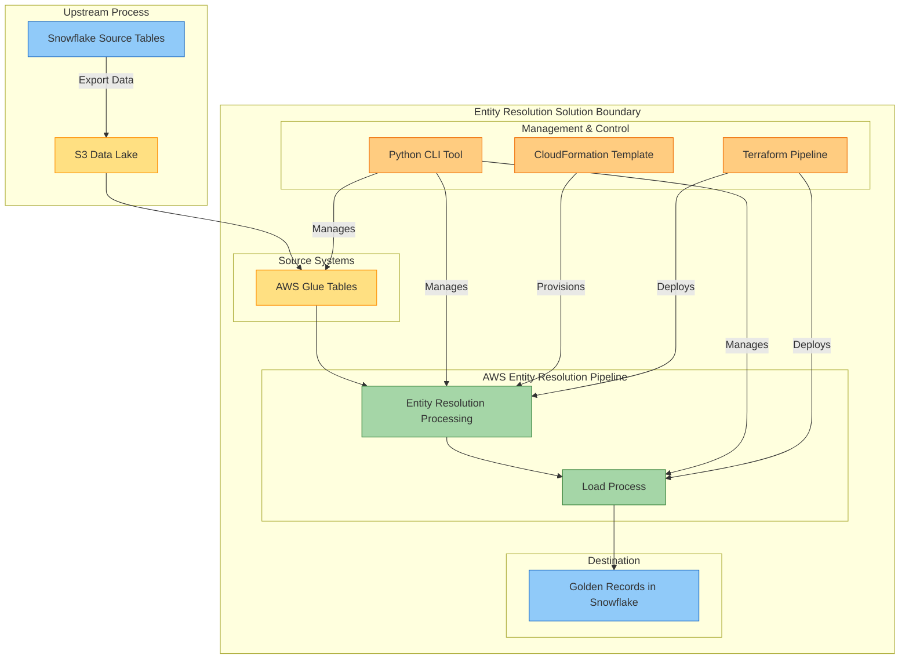
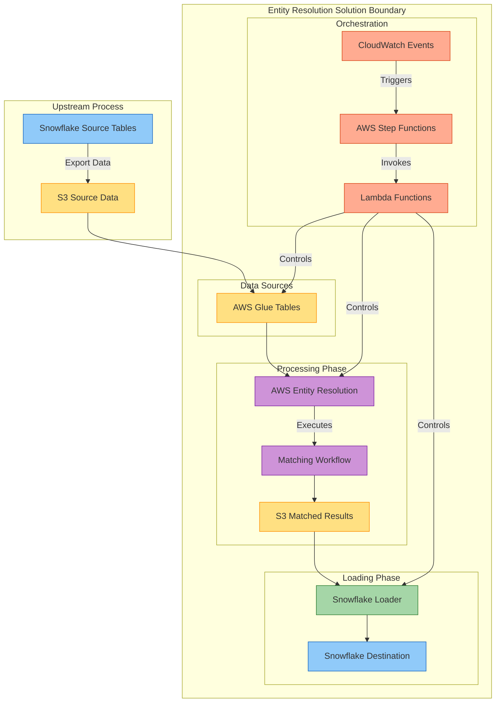
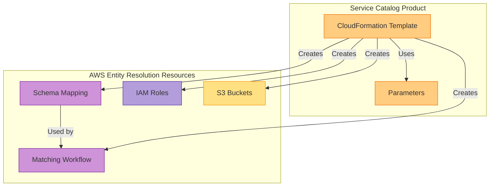
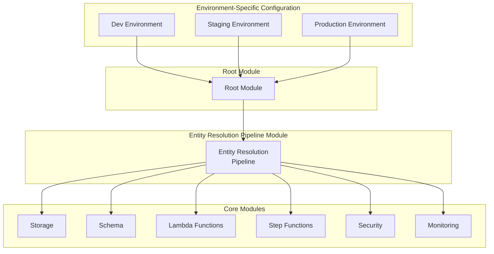
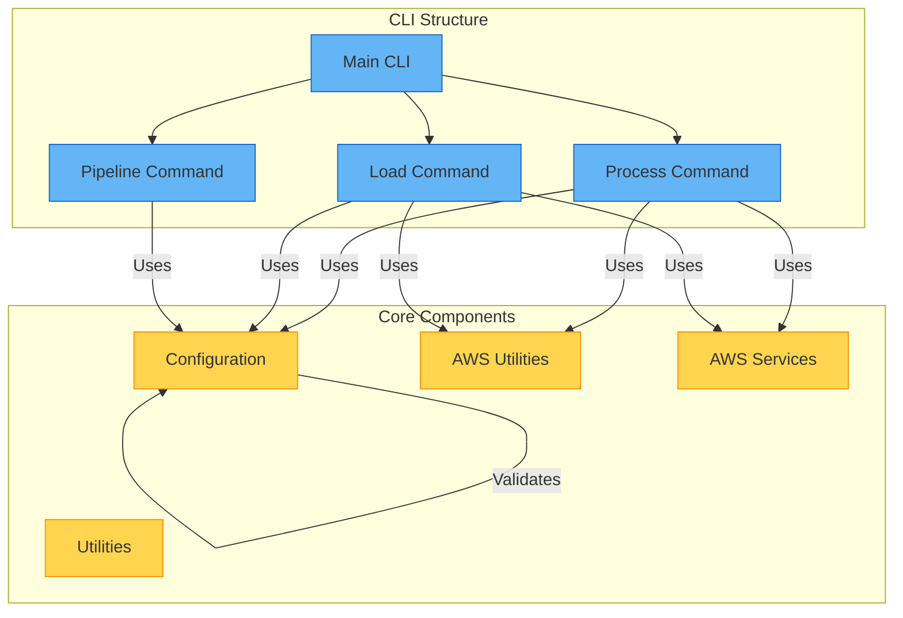

# AWS Entity Resolution Solution

This repository contains a comprehensive solution for entity resolution using AWS services. Entity resolution is the process of identifying and linking records that represent the same entity (customer, product, etc.) across different datasets, creating a unified view.

## Solution Components

This project provides three main components:

1. **CloudFormation Service Catalog Product**: A deployable AWS CloudFormation template for provisioning AWS Entity Resolution infrastructure through Service Catalog
2. **Terraform Pipeline**: A complete data pipeline infrastructure implemented in Terraform that processes data from Glue Tables (pointing to S3) with AWS Entity Resolution and loads resolved entities to Snowflake
3. **Python CLI Tool**: A command-line interface for interacting with the AWS Entity Resolution pipeline

## Documentation

Comprehensive documentation is available in the `docs/` directory:

- [Architecture Documentation](ARCHITECTURE.md) - Detailed architecture overview with diagrams
- [AWS Entity Resolution Guide](docs/AWS_ENTITY_RESOLUTION.md) - Comprehensive guide to AWS Entity Resolution
- [CLI Usage Guide](docs/CLI_USAGE.md) - Detailed guide on using the CLI tool

Additional documentation:
- [Terraform Infrastructure README](terraform/README.md)
- [CloudFormation Product README](cloudformation/entity-resolution-product/README.md)
- [Linting Guide](LINTING.md) - Code quality and linting information

## Solution Architecture

### High-Level Architecture



### Detailed Pipeline Architecture



## CloudFormation Service Catalog Product

The CloudFormation Service Catalog product in `cloudformation/entity-resolution-product/` creates a ready-to-use AWS Entity Resolution infrastructure:



### Key Features:

- Pre-configured AWS Entity Resolution workflow
- Rule-based matching for entity resolution
- Customizable schema for entity attributes
- S3 integration for entity data storage
- IAM roles with least-privilege permissions

## Terraform Entity Resolution Pipeline

The Terraform infrastructure in `terraform/` deploys a complete end-to-end entity resolution pipeline with a modular architecture:



### Key Features:

- Processes data from S3 through AWS Entity Resolution
- Loads resolved data to Snowflake
- Orchestrated execution via AWS Step Functions
- Secure credential management using AWS Secrets Manager
- Comprehensive error handling and retry mechanisms
- Detailed monitoring and alerting

## Python CLI Tool

The Python CLI tool provides a user-friendly interface to interact with the AWS Entity Resolution pipeline:



### Key Features:

- Unified CLI interface for all pipeline stages
- Configuration through environment variables or config files
- Dry-run mode for testing without executing
- Detailed logging and error handling
- Support for custom SQL queries and table overrides

### Installation

```bash
# Install using pip
pip install aws-entity-resolution

# Or install from source
git clone https://github.com/yourusername/aws-entity-resolution.git
cd aws-entity-resolution
pip install -e .
```

### Usage

```bash
# Run the complete pipeline
entity-resolution run-pipeline

# Process data through AWS Entity Resolution
entity-resolution process run

# Load matched records to Snowflake
entity-resolution load run

# Show help
entity-resolution --help
```

## Getting Started

### Prerequisites

- AWS Account with appropriate permissions
- Python 3.8+
- Snowflake account with appropriate permissions
- AWS CLI configured with appropriate credentials
- Terraform 1.0+ (for infrastructure deployment)

### Service Catalog Product Deployment

1. Navigate to the `cloudformation/entity-resolution-product/` directory
2. Review the README file for detailed instructions
3. Deploy the CloudFormation template to your AWS account
4. Configure the Service Catalog product parameters
5. Launch the product to create the AWS Entity Resolution resources

### Terraform Pipeline Deployment

1. Navigate to the `terraform/` directory
2. Copy `terraform.tfvars.example` to `terraform.tfvars` and customize
3. Run `terraform init` to initialize the Terraform environment
4. Run `terraform plan` to review the planned changes
5. Run `terraform apply` to deploy the infrastructure

### CLI Configuration

1. Copy `.env.example` to `.env` and customize with your settings
2. Configure AWS credentials using environment variables or AWS CLI profiles
3. Configure Snowflake credentials in AWS Secrets Manager
4. Run a test command to verify configuration: `entity-resolution --help`

## Security Considerations

- All S3 buckets have encryption enabled and public access blocked
- IAM roles follow the principle of least privilege
- Snowflake credentials are stored securely in AWS Secrets Manager
- All sensitive data is encrypted both in transit and at rest
- Network security groups restrict access to AWS resources
- AWS KMS is used for key management

## Development

### Code Quality Tools

This project uses several tools to maintain code quality:

- **Ruff**: Used for linting and import sorting
- **Black**: Used for code formatting
- **MyPy**: Used for static type checking
- **Pre-commit**: Used to run linters and formatters before commits

### Running Code Quality Tools

To fix imports using Ruff:

```bash
# Run the import fixing script
./fix_imports.py

# Or use Ruff directly
poetry run ruff check --select=I --fix src tests
```

To run all linters and formatters:

```bash
poetry run pre-commit run --all-files
```

### Running Tests

```bash
# Run all tests
poetry run pytest

# Run tests with coverage
poetry run pytest --cov=src

# Run specific test file
poetry run pytest tests/test_specific_module.py
```

## Project Structure

```
aws-entity-resolution/
├── cloudformation/             # CloudFormation templates and resources
│   └── entity-resolution-product/
├── terraform/                  # Terraform modules and configurations
│   └── entity-resolution-pipeline/
├── src/                        # Python source code
│   └── aws_entity_resolution/  # Main package
│       ├── cli/                # CLI commands and utilities
│       ├── processor/          # Entity resolution processing
│       ├── loader/             # Data loading components
│       └── config/             # Configuration management
├── tests/                      # Test suite
├── scripts/                    # Utility scripts
├── docs/                       # Additional documentation
└── examples/                   # Example configurations and usage
```

## License

This project is licensed under the MIT License - see the LICENSE file for details.

## Contributing

Contributions are welcome! Please feel free to submit a Pull Request.

1. Fork the repository
2. Create your feature branch (`git checkout -b feature/amazing-feature`)
3. Commit your changes (`git commit -m 'Add some amazing feature'`)
4. Push to the branch (`git push origin feature/amazing-feature`)
5. Open a Pull Request

## Developer Guide

### Code Structure and Best Practices

This project follows a service-oriented architecture pattern for AWS interactions. Key points for developers:

#### Service Classes

The project uses service classes to interact with AWS services:

- `S3Service`: Handles S3 operations like listing objects and finding the latest file
- `EntityResolutionService`: Manages AWS Entity Resolution matching jobs

#### Testing

Tests should cover both service classes and any backward compatibility requirements. Use the `tests/test_aws_utils.py` as an example of testing both the deprecated utility functions and the service classes they delegate to.

> **Note**: The deprecated utility functions in `aws_utils.py` have been removed. Use the service classes directly.

## Improved CLI and Configuration

The latest version includes significant improvements to the CLI structure and configuration management:

### Enhanced CLI Structure

The CLI has been refactored to use a more modular and maintainable structure:

- Base command framework for consistent behavior
- Unified error handling and validation
- Common components for configuration validation
- Standardized output formatting

```bash
# Main command with help
aws-entity-resolution --help

# Process data with Entity Resolution
aws-entity-resolution process run input/data.csv --output-prefix results/

# Check job status
aws-entity-resolution process status er-job-12345

# Load results to Snowflake
aws-entity-resolution load run output/matched.csv --target-table GOLDEN_CUSTOMERS

# Display version information
aws-entity-resolution version
```

### Unified Configuration System

The configuration system now supports multiple sources with priority ordering:

1. Environment variables (highest priority)
2. Configuration files (YAML or JSON)
3. AWS Secrets Manager (for sensitive credentials)

Example using a configuration file:

```bash
aws-entity-resolution --config my-config.yaml process run input/data.csv
```

Example using AWS Secrets Manager:

```bash
aws-entity-resolution --secrets-name entity-resolution/prod process run input/data.csv
```

You can use the provided `example.config.yaml` as a template for your configuration.

### Command Structure

```
aws-entity-resolution
├── process
│   ├── run - Process data with Entity Resolution
│   └── status - Check job status
├── load
│   ├── run - Load data to Snowflake
│   └── setup - Set up Snowflake table
└── version - Show version information
```

See the [CLI Usage Guide](docs/CLI_USAGE.md) for more details.
