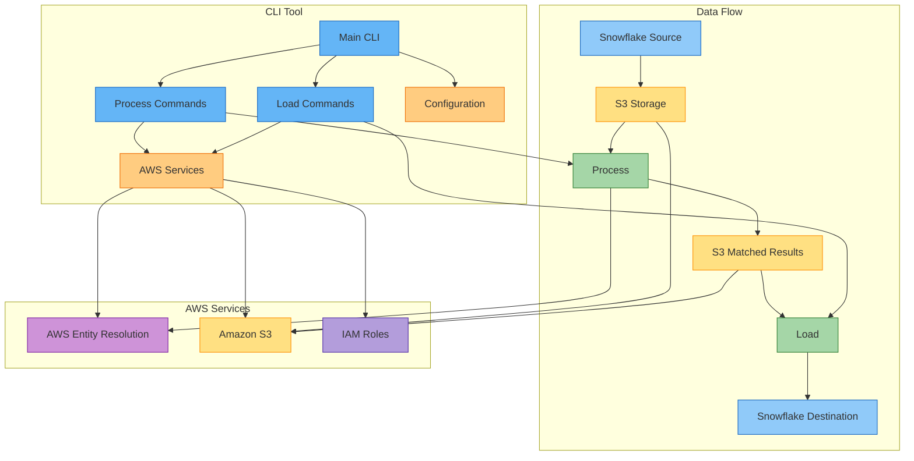
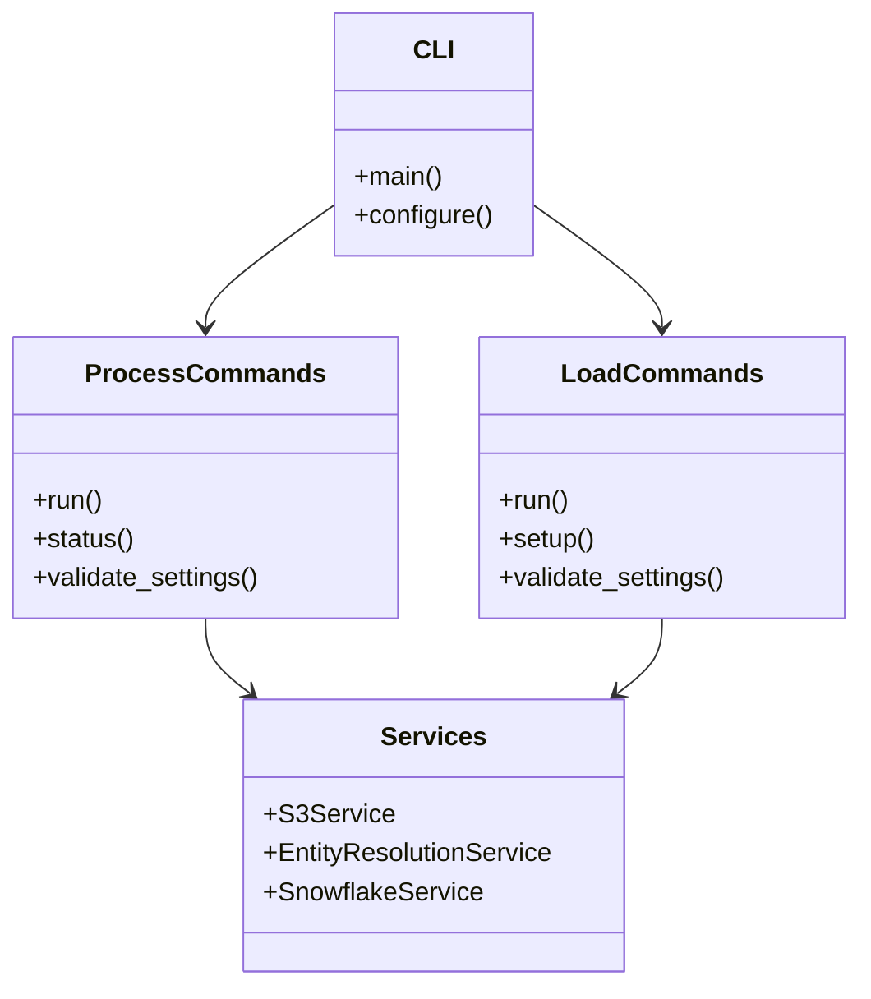
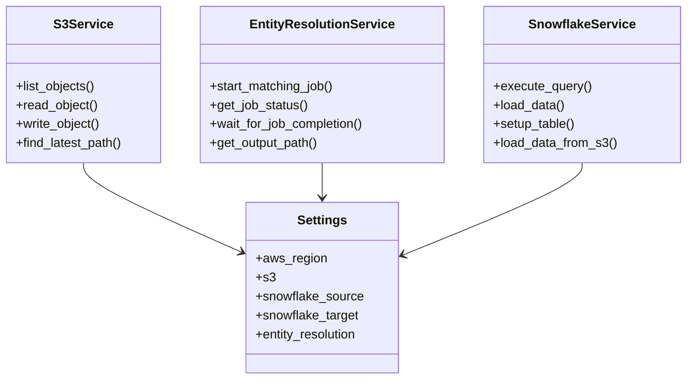
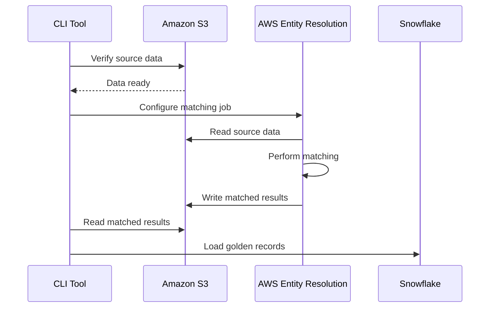

# AWS Entity Resolution - Simplified Architecture

This document provides a simplified overview of the AWS Entity Resolution solution architecture, focusing on the key components and their interactions.

## System Overview

The AWS Entity Resolution solution enables businesses to identify and link records that represent the same entities (customers, products, etc.) across disparate data sources, creating a unified view.



## Key Components

### 1. Python CLI Tool

The CLI tool provides a user-friendly interface for interacting with the AWS Entity Resolution pipeline. It's organized into two main commands:

- **Process**: Processes data through AWS Entity Resolution
- **Load**: Loads processed data back to Snowflake



### 2. Service Layer

The service layer provides a clean interface for interacting with AWS services and Snowflake. Each service follows a consistent pattern and uses dependency injection for configuration.



### 3. Data Flow

The data flows through the system in a sequential process:

1. **Process**: AWS Entity Resolution processes the data from S3 to identify matching records
2. **Load**: Matched records are loaded to Snowflake as golden records



## Code Structure

The codebase follows a clean, modular structure:

```
src/aws_entity_resolution/
├── __init__.py
├── cli/                      # CLI interfaces
│   ├── __init__.py
│   ├── main.py               # Main CLI entry point
│   ├── processor.py          # Processing commands
│   └── loader.py             # Loading commands
├── config/                   # Configuration
│   ├── __init__.py
│   └── factory.py            # Configuration factory
├── services/                 # Service interfaces
│   ├── __init__.py
│   ├── s3.py                 # S3 service
│   ├── entity_resolution.py  # Entity Resolution service
│   ├── snowflake.py          # Snowflake service
│   └── ...                   # Other services
├── processor/                # Data processing
│   ├── __init__.py
│   └── processor.py          # Processing logic
└── loader/                   # Data loading
    ├── __init__.py
    └── loader.py             # Loading logic
```

## Design Patterns

The solution uses several key design patterns:

1. **Dependency Injection**: Services receive their configuration through constructor injection
2. **Command Pattern**: CLI commands encapsulate operations as objects
3. **Service Layer**: Clean separation between business logic and external services
4. **Factory Pattern**: Configuration factory creates and validates settings
5. **Decorator Pattern**: Error handling decorators for consistent error management

## Security Considerations

The solution implements several security best practices:

1. **Least Privilege**: IAM roles with minimal permissions
2. **Encryption**: Data encrypted at rest in S3 and in transit
3. **Credential Management**: Sensitive credentials stored in AWS Secrets Manager
4. **Input Validation**: All user inputs validated before use
5. **Audit Logging**: Comprehensive logging for security auditing
