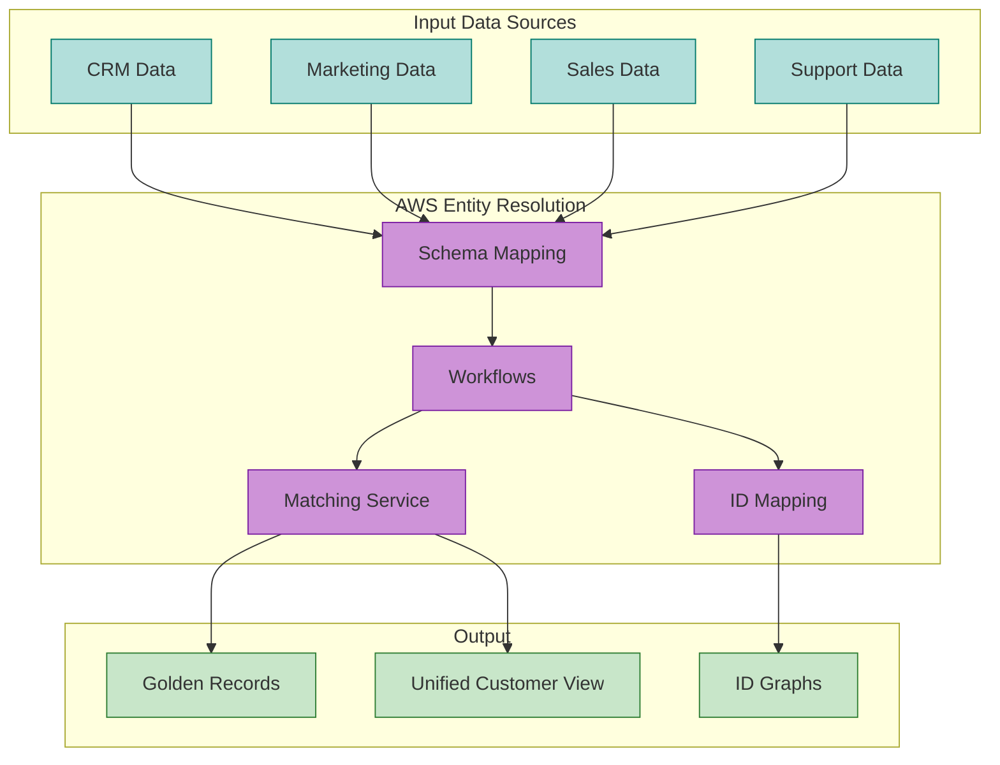
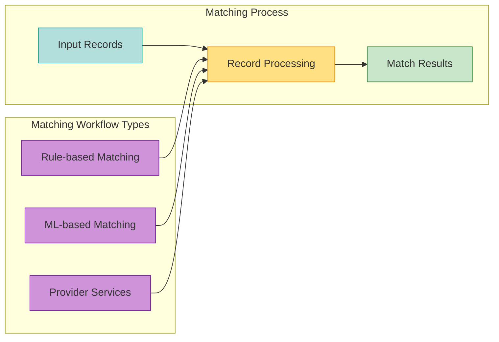
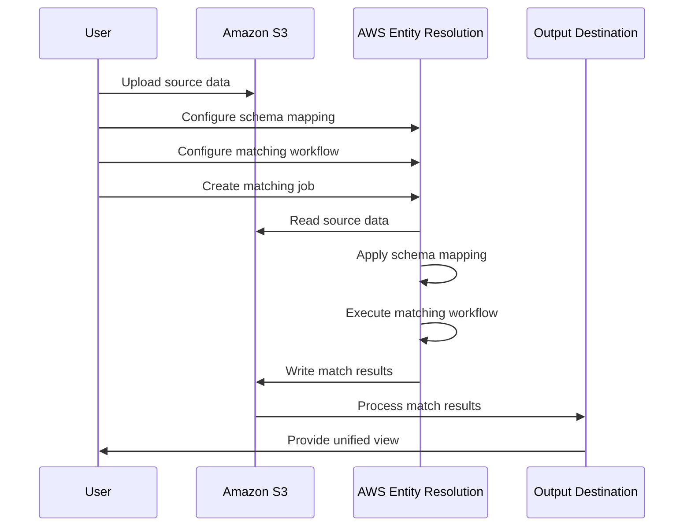
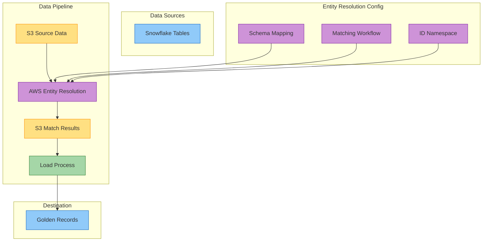

# AWS Entity Resolution Service Guide

This document provides a detailed overview of AWS Entity Resolution service and how it's utilized within our solution.

## What is AWS Entity Resolution?

AWS Entity Resolution is a service that helps you match records across databases, applications, and data sources, allowing you to build more complete customer profiles. It enables you to create a unified view of your entities (such as customers, products, suppliers) by identifying and linking related records.



## Key Concepts

### 1. Schema Mapping

A schema mapping defines how your source data fields map to standardized attributes that AWS Entity Resolution can understand.

```json
{
  "SchemaName": "CustomerMapping",
  "MappedInputFields": [
    {
      "FieldName": "customer_id",
      "Type": "ID"
    },
    {
      "FieldName": "first_name",
      "Type": "NAME"
    },
    {
      "FieldName": "last_name",
      "Type": "NAME"
    },
    {
      "FieldName": "email",
      "Type": "EMAIL"
    },
    {
      "FieldName": "phone",
      "Type": "PHONE"
    },
    {
      "FieldName": "address",
      "Type": "ADDRESS"
    }
  ]
}
```

### 2. Matching Workflow

A matching workflow defines how records are compared and matched. AWS Entity Resolution supports three types of matching workflows:

1. **Rule-based matching**: Define exact matching rules based on your business requirements
2. **ML-based matching**: Use machine learning to identify likely matches
3. **Provider services**: Use third-party identity resolution providers



### 3. ID Namespace

An ID namespace represents a collection of identifiers that belong to the same identity space. It allows you to maintain relationships between different identifier systems.

### 4. Matching Job

A matching job is an execution of a matching workflow against a specific dataset. When you run a matching job, AWS Entity Resolution processes your input data and produces match results.

## How AWS Entity Resolution Works

The entity resolution process involves several steps:



1. **Data Preparation**: Format your source data in CSV or JSON and upload it to S3
2. **Schema Mapping**: Define how your fields map to Entity Resolution attributes
3. **Workflow Configuration**: Set up your matching rules or ML model
4. **Job Execution**: Run a matching job against your data
5. **Result Processing**: Process the match results to create golden records

## Rule-Based Matching

Rule-based matching uses explicit rules to determine if records match. You can define matching rules based on exact matches, fuzzy matches, or transformations.

### Example Rule-Based Matching Configuration

```json
{
  "RuleName": "CustomerMatching",
  "MatchingKeys": [
    {
      "MatchingKey": [
        {
          "FieldName": "email",
          "ExactMatch": true
        }
      ]
    },
    {
      "MatchingKey": [
        {
          "FieldName": "phone",
          "ExactMatch": true
        }
      ]
    },
    {
      "MatchingKey": [
        {
          "FieldName": "first_name",
          "ExactMatch": false,
          "FuzzyMatchScore": 0.8
        },
        {
          "FieldName": "last_name",
          "ExactMatch": false,
          "FuzzyMatchScore": 0.8
        },
        {
          "FieldName": "address",
          "ExactMatch": false,
          "FuzzyMatchScore": 0.7
        }
      ]
    }
  ]
}
```

## ML-Based Matching

ML-based matching uses machine learning to identify likely matches based on training data. This is useful when exact rules are difficult to define or when dealing with complex matching scenarios.

The ML model evaluates pairs of records and assigns a match probability score. Records with scores above a threshold are considered matches.

## Provider Services

AWS Entity Resolution integrates with third-party identity resolution providers:

1. **LiveRamp**: Offers identity resolution with a focus on marketing use cases
2. **TransUnion**: Provides identity resolution with credit and risk data enrichment
3. **Acxiom**: Offers identity resolution with consumer data enrichment

## Match Output Format

AWS Entity Resolution produces match output in a structured format:

```json
{
  "sourceId": "12345",
  "matchId": "M-67890",
  "confidenceScore": 0.95,
  "matchType": "rule",
  "ruleId": "Rule-1",
  "sourceFields": {
    "customer_id": "12345",
    "first_name": "John",
    "last_name": "Smith",
    "email": "john.smith@example.com",
    "phone": "555-123-4567",
    "address": "123 Main St, Anytown, USA"
  }
}
```

The output includes:
- Source record identifier
- Match identifier (groups records that match)
- Confidence score (how confident the system is about the match)
- Match type (rule, ML, or provider)
- Rule identifier (if using rule-based matching)
- Source record fields

## AWS Entity Resolution in Our Solution

Our solution uses AWS Entity Resolution with the following pattern:



### Key Components

1. **S3 Source Data**: Source data stored in S3 in a format compatible with Entity Resolution
2. **Entity Resolution Schema**: Defines how fields map to standardized attributes
3. **Entity Resolution Workflow**: Processes data and produces matching results
4. **Load Process**: Lambda function loads matched data into Snowflake
5. **Golden Records**: Unified view of entities stored in Snowflake

### Schema Mapping Configuration

Our solution uses a schema mapping that aligns with common customer data attributes:

```yaml
SchemaName: CustomerDataMapping
MappedInputFields:
  - FieldName: customer_id
    Type: ID
  - FieldName: first_name
    Type: NAME
  - FieldName: last_name
    Type: NAME
  - FieldName: email
    Type: EMAIL
  - FieldName: phone
    Type: PHONE
  - FieldName: address_line_1
    Type: ADDRESS
  - FieldName: city
    Type: ADDRESS
  - FieldName: state
    Type: ADDRESS
  - FieldName: postal_code
    Type: ADDRESS
  - FieldName: country
    Type: ADDRESS
  - FieldName: date_of_birth
    Type: DATE
```

### Matching Workflow Configuration

Our solution uses rule-based matching with configurable rules:

```yaml
WorkflowName: CustomerMatchingWorkflow
MatchingType: RULE_BASED
RuleBasedMatchingConfig:
  Rules:
    - RuleName: EmailMatch
      MatchingKeys:
        - MatchingKey:
            - FieldName: email
              ExactMatch: true
    - RuleName: PhoneMatch
      MatchingKeys:
        - MatchingKey:
            - FieldName: phone
              ExactMatch: true
    - RuleName: NameAddressMatch
      MatchingKeys:
        - MatchingKey:
            - FieldName: first_name
              ExactMatch: false
              FuzzyMatchScore: 0.8
            - FieldName: last_name
              ExactMatch: false
              FuzzyMatchScore: 0.8
            - FieldName: address_line_1
              ExactMatch: false
              FuzzyMatchScore: 0.7
            - FieldName: postal_code
              ExactMatch: true
```

## Best Practices

### Data Preparation

1. **Standardize Data**: Normalize fields like names, addresses, and phone numbers
2. **Handle Missing Values**: Develop a strategy for records with missing attributes
3. **Remove Duplicates**: Pre-deduplicate within each source when possible
4. **Data Quality**: Implement data quality checks before processing

### Schema Mapping

1. **Field Alignment**: Map fields to the most appropriate attribute types
2. **Consistency**: Use consistent mapping across different data sources
3. **Compound Fields**: Split compound fields (e.g., full name into first/last)
4. **Normalization**: Normalize fields to standard formats where possible

### Matching Rules

1. **Start Simple**: Begin with simple rules and iterate
2. **Balance Precision and Recall**: Adjust rules to balance false positives and negatives
3. **Rule Priority**: Order rules from most to least precise
4. **Test and Validate**: Test matching rules with sample data before production use

### Performance Optimization

1. **Data Partitioning**: Process large datasets in smaller chunks
2. **Field Selection**: Only include fields necessary for matching
3. **Matching Key Optimization**: Use the most discriminating fields first
4. **Result Caching**: Cache match results for repeated processing

## Common Use Cases

1. **Customer 360**: Create unified customer profiles across systems
2. **Marketing Deduplication**: Remove duplicate contacts from marketing campaigns
3. **Fraud Detection**: Identify related entities for fraud analysis
4. **Regulatory Compliance**: Match records for KYC (Know Your Customer) requirements
5. **Supply Chain Management**: Create unified supplier and product catalogs

## Limitations and Considerations

1. **Data Privacy**: Ensure compliance with relevant data privacy regulations
2. **Data Volume**: Consider processing time for very large datasets
3. **Match Quality**: Monitor and validate match quality on an ongoing basis
4. **Cost Management**: Optimize processing to manage costs
5. **Rule Complexity**: Balance rule complexity against performance

## Resources

- [AWS Entity Resolution Documentation](https://docs.aws.amazon.com/entityresolution/latest/userguide/what-is-entityresolution.html)
- [API Reference](https://docs.aws.amazon.com/entityresolution/latest/APIReference/Welcome.html)
- [AWS CLI Reference](https://docs.aws.amazon.com/cli/latest/reference/entityresolution/index.html)
- [AWS SDK Examples](https://github.com/awsdocs/aws-doc-sdk-examples)
