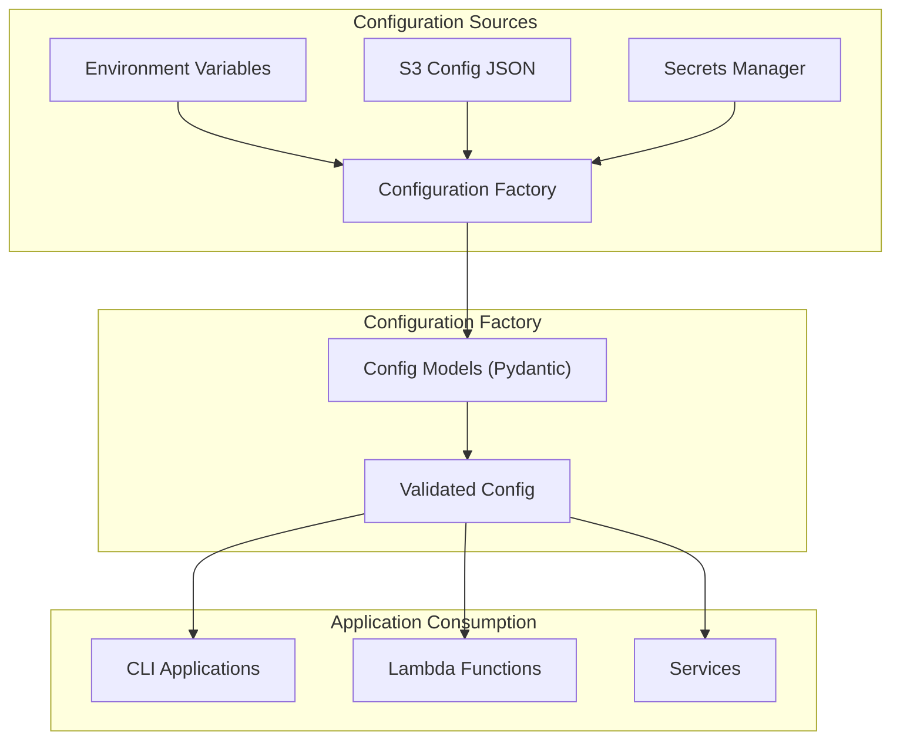

# Entity Resolution Configuration

This module provides a configuration system for the Entity Resolution application that decouples the application from direct Terraform state access. It prioritizes configuration sources in the following order:

1. Environment variables (highest priority)
2. S3 configuration file (for complex configurations)
3. AWS Secrets Manager (for sensitive configuration)

## Features

- Type-validated configuration with Pydantic models
- Automatic environment detection (dev, test, staging, prod)
- Simple configuration access for both CLI and Lambda applications
- Secure storage of sensitive information
- Graceful fallbacks between different configuration sources
- Backward compatibility with legacy environment variables

## How It Works

The configuration system works by:

1. **First loading environment variables** - This is the highest priority and allows for easy overrides.
2. **Then loading from S3** - An S3 JSON file can provide complex configuration that might be difficult to express as environment variables.
3. **Finally loading sensitive configuration from Secrets Manager** - This ensures sensitive information like database credentials is securely stored.

## Usage Examples

### Basic Usage

```python
from aws_entity_resolution.config.factory import get_config

# Get the application configuration
config = get_config()

# Use configuration values
s3_bucket = config.s3.bucket
workflow_name = config.entity_resolution.workflow_name
```

### Lambda Functions

```python
from aws_entity_resolution.config.lambda_helpers import configure_lambda_handler

@configure_lambda_handler
def my_lambda_handler(event, context):
    # Configuration is automatically loaded and validated
    # Use the lambda_helpers module to simplify Lambda configuration

    # Access the configuration
    from aws_entity_resolution.config.factory import get_config
    config = get_config()

    # ... your handler logic ...

    return {
        "statusCode": 200,
        "body": {
            "message": "Success",
            "workflow_name": config.entity_resolution.workflow_name
        }
    }
```

### CLI Applications

```python
from aws_entity_resolution.config.factory import create_config, Environment

# For CLI applications, you might want to specify the environment
config = create_config(
    environment=Environment.PROD,
    s3_config_enabled=True,
    secrets_manager_enabled=True
)

# ... your CLI logic ...
```

## Configuration Sources

### Environment Variables

The application looks for the following environment variables:

#### Basic Configuration
- `ENVIRONMENT` - Application environment (dev, test, staging, prod)
- `LOG_LEVEL` - Logging level (DEBUG, INFO, WARNING, ERROR)

#### AWS Configuration
- `AWS_REGION` - AWS region
- `AWS_PROFILE` - AWS profile (for local development)
- `AWS_ROLE_ARN` - AWS role ARN to assume

#### S3 Configuration
- `S3_BUCKET` - S3 bucket for data storage
- `S3_PREFIX` - S3 prefix for data
- `S3_REGION` - S3 region (defaults to AWS_REGION)

#### Entity Resolution Configuration
- `ER_WORKFLOW_NAME` - Entity Resolution workflow name
- `ER_SCHEMA_NAME` - Entity Resolution schema name
- `ER_ENTITY_ATTRIBUTES` - Comma-separated list of entity attributes
- `ER_MATCHING_THRESHOLD` - Matching threshold (float between 0 and 1)
- `ER_MAX_MATCHES_PER_RECORD` - Maximum matches per record (int > 0)

#### Table Configuration
- `SOURCE_TABLE` - Source table name
- `TARGET_TABLE` - Target table name (defaults to "GOLDEN_ENTITY_RECORDS")

#### Snowflake Source Configuration
- `SNOWFLAKE_SOURCE_ACCOUNT` - Snowflake source account
- `SNOWFLAKE_SOURCE_USERNAME` - Snowflake source username
- `SNOWFLAKE_SOURCE_PASSWORD` - Snowflake source password
- `SNOWFLAKE_SOURCE_ROLE` - Snowflake source role (defaults to "ACCOUNTADMIN")
- `SNOWFLAKE_SOURCE_WAREHOUSE` - Snowflake source warehouse
- `SNOWFLAKE_SOURCE_DATABASE` - Snowflake source database
- `SNOWFLAKE_SOURCE_SCHEMA` - Snowflake source schema

#### Snowflake Target Configuration
- `SNOWFLAKE_TARGET_ACCOUNT` - Snowflake target account
- `SNOWFLAKE_TARGET_USERNAME` - Snowflake target username
- `SNOWFLAKE_TARGET_PASSWORD` - Snowflake target password
- `SNOWFLAKE_TARGET_ROLE` - Snowflake target role (defaults to "ACCOUNTADMIN")
- `SNOWFLAKE_TARGET_WAREHOUSE` - Snowflake target warehouse
- `SNOWFLAKE_TARGET_DATABASE` - Snowflake target database
- `SNOWFLAKE_TARGET_SCHEMA` - Snowflake target schema

#### Legacy Environment Variables (for backward compatibility)
- `SNOWFLAKE_ACCOUNT` - Snowflake account
- `SNOWFLAKE_USERNAME` - Snowflake username
- `SNOWFLAKE_PASSWORD` - Snowflake password
- `SNOWFLAKE_ROLE` - Snowflake role
- `SNOWFLAKE_WAREHOUSE` - Snowflake warehouse

### S3 Configuration

For more complex configurations, the application can load a JSON file from S3. The S3 bucket and key are specified using the following environment variables:

- `CONFIG_S3_BUCKET` - S3 bucket containing configuration
- `CONFIG_S3_KEY` - S3 key for configuration file

### Secrets Manager

Sensitive configuration, such as Snowflake credentials, can be stored in AWS Secrets Manager. The secrets are specified using the following environment variables:

- `SNOWFLAKE_SOURCE_SECRET_ID` - Secret ID for Snowflake source credentials
- `SNOWFLAKE_TARGET_SECRET_ID` - Secret ID for Snowflake target credentials

## Command Line Tool

The package includes a command-line tool to help with configuration management. You can run it with:

```
python -m aws_entity_resolution.cli.config_example --help
```

This tool can show configuration settings, export environment variables, or output JSON configuration.

## Architecture Diagram



## Terraform Integration

The configuration is designed to work seamlessly with Terraform-managed infrastructure. Terraform exports configuration values to:

1. Environment variables for Lambda functions
2. S3 JSON file for complex configuration
3. Secrets Manager for sensitive information

This approach ensures that the application is completely decoupled from direct Terraform state access, making it more robust and maintainable.
