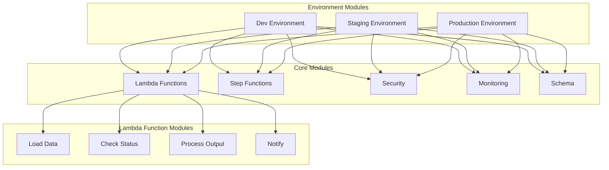
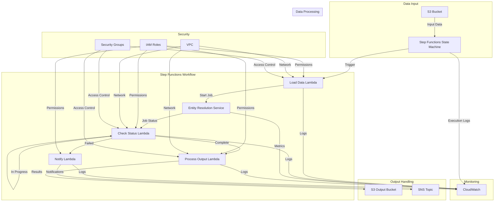

# Entity Resolution Pipeline Architecture

This document describes the architecture of the Entity Resolution pipeline implemented using AWS services and Terraform modules.

## Module Structure



## Infrastructure Flow



## Directory Structure

```
terraform/
├── modules/
│   ├── lambda-functions/
│   │   ├── load-data/
│   │   ├── check-status/
│   │   ├── process-output/
│   │   └── notify/
│   ├── step-functions/
│   ├── security/
│   ├── monitoring/
│   └── schema/
└── environments/
    ├── dev/
    ├── staging/
    └── prod/
```

## Module Dependencies

Each environment module (`dev`, `staging`, `prod`) orchestrates the following components:

1. **Lambda Functions**
   - Load Data: Handles initial data ingestion
   - Check Status: Monitors job progress
   - Process Output: Handles successful job results
   - Notify: Manages error notifications

2. **Step Functions**
   - State Machine: Orchestrates the workflow
   - Error Handling: Manages failures and retries
   - Monitoring: Tracks execution status

3. **Security**
   - IAM Roles: Least privilege access
   - VPC Configuration: Network isolation
   - Security Groups: Access control

4. **Monitoring**
   - CloudWatch Logs: Centralized logging
   - CloudWatch Metrics: Performance monitoring
   - CloudWatch Alarms: Automated alerting

5. **Schema Management**
   - Version Control: Schema versioning
   - Validation: Data quality checks
   - Documentation: Schema documentation

## Security Architecture

1. **Network Security**
   - Lambda functions run in VPC
   - Security groups control access
   - VPC endpoints for AWS services

2. **Identity and Access**
   - IAM roles follow least privilege
   - Resource-based policies
   - Service-linked roles

3. **Data Protection**
   - S3 bucket encryption
   - CloudWatch log encryption
   - In-transit encryption

## Deployment Strategy

1. **Environment Separation**
   - Separate state files
   - Environment-specific variables
   - Consistent tagging

2. **State Management**
   - Remote state in S3
   - State locking with DynamoDB
   - Backup and versioning

3. **CI/CD Integration**
   - Automated testing
   - Infrastructure validation
   - Deployment approval process
