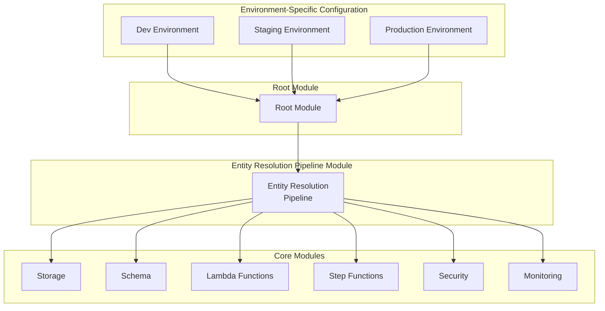

# AWS Entity Resolution Pipeline - Terraform Infrastructure

This repository contains Terraform code to deploy an AWS Entity Resolution pipeline that processes customer data across multiple environments.

## Architecture Overview



## New Structure Benefits

1. **Elimination of Duplicate Code**
   - Centralized pipeline module eliminates environment-specific code duplication
   - Common configuration in variables and modules instead of copy-paste

2. **Simplified Customer Configuration**
   - Single configuration file per environment (`env.tfvars`)
   - Clear separation between environment configuration and core infrastructure

3. **SDLC Environment Consistency**
   - Same module used across development, staging, and production
   - Environment-specific settings via variables only

4. **Support for New Workflows**
   - Core logic encapsulated in reusable modules
   - Multiple pipelines can be created using the same modules
   - Add new schemas without changing infrastructure code

## Directory Structure

```
terraform/
├── environments/            # Environment-specific configurations
│   ├── dev/                 # Development environment
│   │   └── env.tfvars       # Dev environment variables
│   ├── staging/             # Staging environment
│   │   └── env.tfvars       # Staging environment variables
│   └── prod/                # Production environment
│       └── env.tfvars       # Production environment variables
├── modules/                 # Shared modules
│   ├── entity-resolution-pipeline/  # Main pipeline module
│   ├── common/              # Common infrastructure
│   ├── config/              # Configuration management
│   ├── lambda-functions/    # Lambda functions
│   ├── schema/              # Schema definitions
│   ├── security/            # Security resources (IAM, KMS)
│   ├── step-functions/      # Step Functions workflows
│   ├── storage/             # Storage resources (S3, Glue)
│   └── monitoring/          # Monitoring and alerting
├── main.tf                  # Root module configuration
├── variables.tf             # Root module variables
└── outputs.tf               # Root module outputs
```

## Usage

### Deploying to a Specific Environment

1. Initialize Terraform using specific environment variables:

```bash
terraform init
```

2. Plan the deployment:

```bash
terraform plan -var-file=environments/dev/env.tfvars
```

3. Apply the configuration:

```bash
terraform apply -var-file=environments/dev/env.tfvars
```

### Creating a New Workflow

1. Add a new environment configuration file:

```bash
cp environments/dev/env.tfvars environments/custom/env.tfvars
```

2. Modify the settings as needed (workflow name, schema, etc.)
3. Deploy as a new environment:

```bash
terraform apply -var-file=environments/custom/env.tfvars
```

## Module Parameters

The Entity Resolution Pipeline module accepts the following key parameters:

- **Project Configuration**: project_name, environment, aws_region
- **Storage Configuration**: s3_bucket_name, s3_input/output_prefix
- **Entity Resolution Configuration**: er_workflow_name, schema_definition
- **Lambda Configuration**: lambda_runtime, lambda_timeout, lambda_memory_size
- **Network Configuration**: subnet_ids, vpc_id
- **Notification Configuration**: notification_email, notification_topic_arn

See the variables.tf file for a complete list of available parameters.

## Best Practices

1. Use environment-specific branches for managing configuration changes
2. Store sensitive information in AWS Secrets Manager or use environment variables
3. Use remote state backend for team collaboration
4. Apply changes through a CI/CD pipeline after testing
5. Review all plans before applying changes
